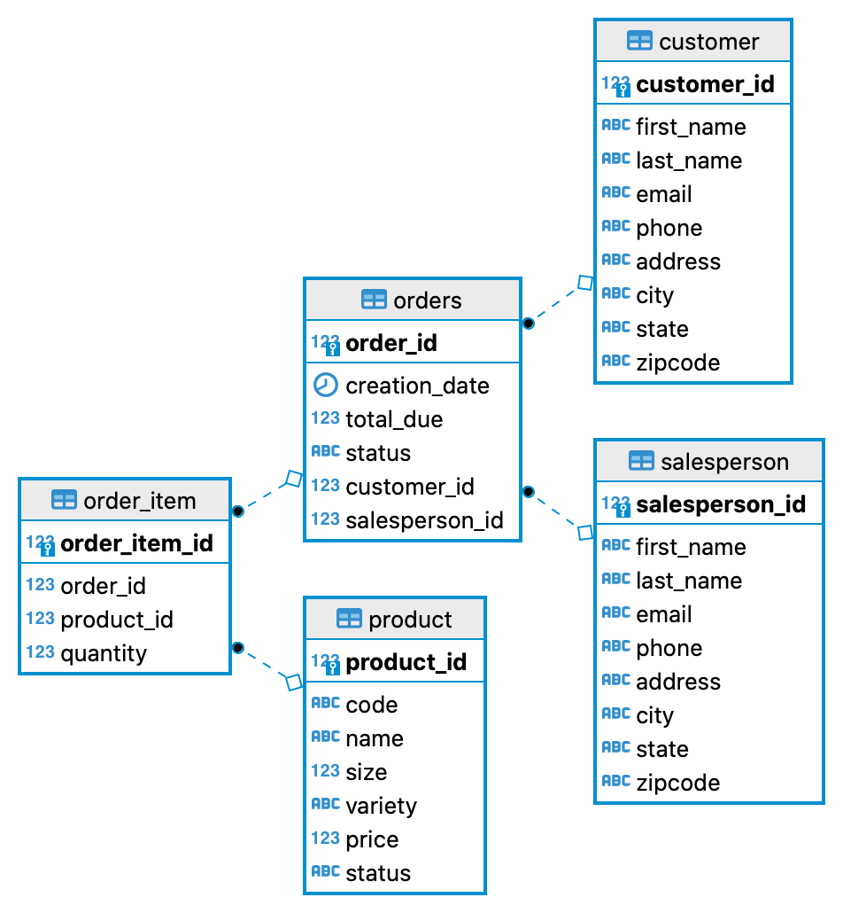

# JDBC Project

## Introduction
In this project, I created a Java application to access a Postgres database using the Java Database Connectivity (JDBC) API. The JDBC API is used for client-side access to a Relational Database Management System (RDBMS). 
The instance of the Postgres database runs in a Docker container. Other technologies used include IntelliJ IDE and Maven for dependency management.
The psql client tool is used to interact directly with the Postgres database instance in the terminal. I also used DBeaver to create the Entity Relationship Diagram for our database.

## Quick Start

### Prerequisites
1. Docker is installed.
2. psql client is installed.

### Application Setup

Pull docker image
`docker pull postgres`

Build data directory
`mkdir -p ~/src/postgres`

Run docker image to have a running container
`docker run --rm --name lil-postgres -e POSTGRES_PASSWORD=password -d -v $HOME/src/postgres:/var/lib/postgresql/data -p 5432:5432 postgres`

Create database using the database.sql script
`psql -h localhost -U postgres -f database.sql`

Log into the database called hplussport
`psql -h localhost -U postgres -d hplussport`

Execute the rest of the sql scripts to create the database tables
1. `psql -h localhost -U postgres -d hplussport -f customer.sql`
2. `psql -h localhost -U postgres -d hplussport -f product.sql`
3. `psql -h localhost -U postgres -d hplussport -f salesperson.sql`
4. `psql -h localhost -U postgres -d hplussport -f orders.sql`

Run the JDBCExecutor.java main class to execute CRUD operations.

Stop docker container
`docker stop lil-postgres`

## Implementation
### ER Diagram

### JDBC Workflow
JDBC allows a connection between a Java Application and an RDBMS. With JDBC, we can get data into and out of any application on any platform using any relational database.

The Application follows the basic JDBC Workflow:
1. Mount the Driver to the Application.
2. Create a Connection to the database using the Driver.
3. Execute SQL statements through the Connection.
4. Commit changes or Roll them back.
5. Close the Connection.

## Design Patterns
This project leverages the Data Access Object (DAO) design pattern to isolate the business layer from the persistence layer.
DAO hides the complexities of the CRUD operations from the domain object using the DAO layer. Our Application's domain logic 
does not interact with the database directly, instead it communicates with the DAO layer which further communicates with the underlying storage (the database).
This ensures low coupling between the two classes hence changes in one does not affect the other. Any changes to the CRUD operations only requires changes in the DAO layer and not in the domain class and vice versa.

To implement DAO, I created two DAO classes for the `Customer` and `Order` domain objects. 
In order to execute any CRUD operation, the DAO object is called that handles the database connection and query execution and returns the query result if applicable.

Repository pattern is very similar to DAO except that latter is table-centric whereas Repository is more domain-centric.
Repository accesses single-table per class, so instead of joining tables in the database, it joins data in the code.
In the DOA pattern, two tables are joined in the database where a Foreign Key relationship exists.

The DAO pattern is suitable for this project as it does not involve a lot of business logic.

## Test
To test the application, I setup the PostgreSQL database using Docker. The database and the tables were created using sql scripts.
The test records were inserted into the tables and queries were executed on this test data.
After execution of a query, I manually queried the postgres database tables using the psql CLI to check if they contain the inserted, deleted or updated records. For read operations, I checked if it matches the particular record(s).

