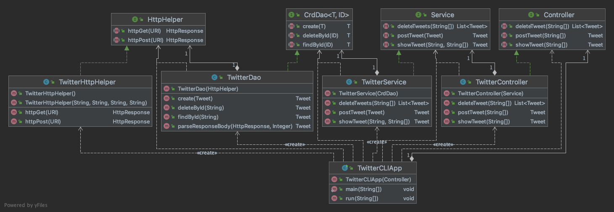

# Twitter CLI App

## Introduction
The Twitter CLI App allows users to post, view, or delete Tweets from the Command Line Interface. The Application interacts with the Twitter REST API to send and receive HTTP Requests and Responses respectively by using the HTTPClient and OAuth 1.0 libraries.
Jackson library was used to serialize Java objects to JSON and vice versa. The App conforms to the MVC Design Pattern. Apache Maven was used to manage project dependencies and the app was deployed using Docker.

Some other technologies learned as part of the project include POSTMAN, Spring, and Springboot.
## Quick Start
#### Obtain keys and setup the environment variables for Twitter API authorization
- `export consumerKey = consumerKey_value`
- `export consumerSecret = consumerSecret_value`
- `export accessToken = accessToken_value`
- `export tokenSecret = tokenSecret_value`

#### Run App using Docker 
- Pull Docker Image from Docker Hub:
  `docker pull fanwer291/twittercli`
  
- Run container:
```
docker run --rm \
    -e consumerKey=YOUR_VALUE \
    -e consumerSecret=YOUR_VALUE \
    -e accessToken=YOUR_VALUE \
    -e tokenSecret=YOUR_VALUE \
    fanwer291/twittercli post|show|delete [options]
```
Options:
- post: tweet_text, latitude:longitude
- show: tweet_id [field1,field2 ...]
- delete: [id1, id2, ...]
## Design
### UML diagram


The Application is designed using the MVC Design Architecture. There are three main layers, the Controller, Service, and Data Access Object (DAO) layer.
Additionally, the Application layer interfaces between the CLI and these layers. The Components include:

#### App/Main
The TwitterCLIApp initializes all component dependencies and passes the CLI arguments to the Controller Layer. The methods from the Controller Layer are called. 
#### Controller
The TwitterController layer consumes the arguments and calls the corresponding Service layer methods.
#### Service
The Service layer class, TwitterService handles the business logic of the application. It checks the following conditions:
  1. The tweet text must not exceed 140 characters and the latitude and longitude values must not be out of range.
  2. The id should be in correct format and the tweet fields should be valid.
  
##### DAO
The TwitterDAO layer class handles data coming from the external service (Twitter REST API). TwitterDao constructs Twitter REST API URIs and make HTTP calls using HttpHelper.
  
##### TwitterHttpHelper
This class uses the corresponding URI to execute the HTTP requests made to the Twitter API and return the response data to the DAO layer.

## Models
Models are implemented with Plain Old Java Objects with private member variables and public getters and setters. This class encapsulates Tweet Data.

The Models include:
- Tweet (Tweet object, contains Entities, Coordinates objects)
- Coordinates
- Hashtag
- UserMention
- Entities (Entities object, contains Hashtag and UserMention objects)

## Spring
In this project, the class dependencies were managed using the Springboot framework. The application has four Beans, 
TwitterController, TwitterService, TwitterDao,and TwitterHttpHelper. Each of the layer's responsibility was indicated by using the
@Controller, @Service, @Repository and @Component annotations respectively.
The TwitterCLISpringBoot application, marked using @SpringBootApplication, 
manages the dependencies by injecting dependencies 
using the '@Autowired' annotation used on every 
Constructor of the dependent classes.


## Test
For each component of the application unit and integration tests were performed using Junit4 and Mockito.
Tests for both successful and unsuccessful execution were run to see if the application is behaving as expected in each case.

## Deployment
The App and its dependencies are packaged into a jar file using Maven. A Dockerfile which uses openjdk:8-alpine as a base image along 
with project Uber JAR file is used to create a Docker image. This newly created image of our application 
is configured to run the main class as it is set as the Entry point. The image was then pushed to the DockerHub for easy deployment.

## Improvements
- The Application can be improved by developing an easy-to-use Graphical User Interface instead of CLI.
- Update the Tweet object to hold all fields that of a real Tweet.  
- Take user's real-time location information instead of lat/lon as an input option.
- Show multiple Tweets by taking more than one Tweet ID as an option.