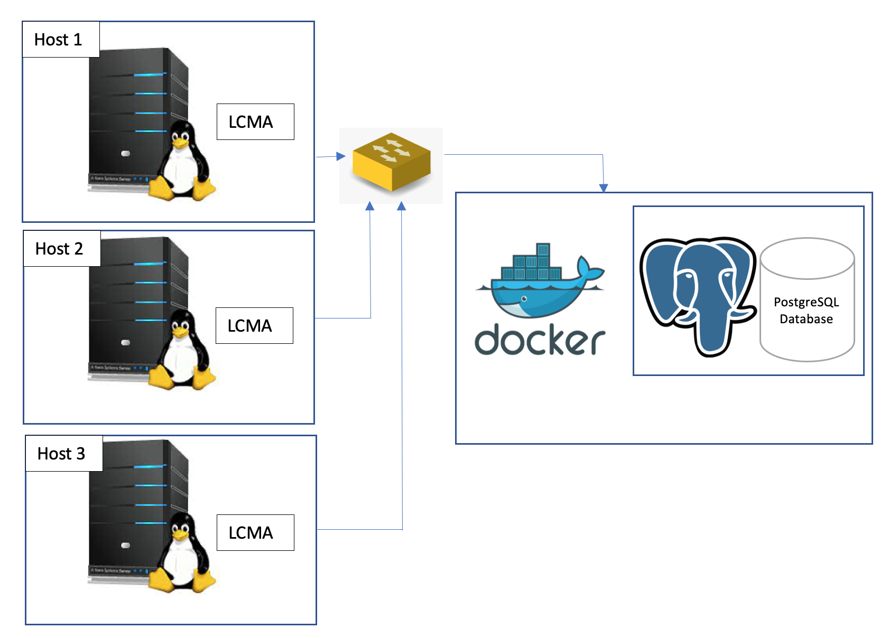

# Linux Cluster Monitoring Agent

## Introduction
The Linux Cluster Monitoring Agent (LCMA) software collects hardware specifications and usage data of machines with Linux Operating System. LCMA is installed on each host machine that collects this data and stores it in a database. The usage data is collected at a minute interval. 
The potential users of this product could be any enterprise or organization of any scale or individuals who want to monitor their linux machine(s) hardware and usage information. This could be a single machine/server or a cluster of linux servers.   
The technology used to build and deliver this product includes Bash, Docker, PostgreSQL, Git, and Github. This project was implemented on a CentOS virtual machine on the Google Cloud Platform.

## Quick Start
Execute the commands in bash shell.
```
#Create/Start/Stop a PostgreSQL (psql) instance using psql_docker.sh:

#create 
./scripts/psql_docker.sh create [db_username] [db_password]

#start
./scripts/psql_docker.sh start

#stop
./scripts/psql_docker.sh stop

#Connect to the psql instance and create database and tables
psql -h hostname -U [db_username] -c "CREATE DATABASE host_agent;"
psql -h hostname -U [db_username] -d host_agent -f ./sql/ddl.sql

#Insert hardware specs data into host_info table using host_info.sh
./scripts/host_info.sh hostname 5432 host_agent [db_username] [db_password]

#Insert hardware specs data into host_usage table using host_usage.sh
./scripts/host_usage.sh hostname 5432 host_agent [db_username] [db_password]

#Crontab setup  
crontab -e
# Add this in crontab editor
* * * * * bash /global/path/to/host_usage.sh hostname 5432 host_agent [db_username] [db_password] > /tmp/host_usage.log
```

## Implementation
The project is implemented using three bash scripts and two sql scripts. The steps are explained in order of implementation:
1. The first bash script (psql_docker.sh) creates a Docker container running PostgreSQL instance. The script can also start and stop the container.
2. The ddl.sql script creates two database tables in the `host_agent` database called `host_info` and `host_usage`. The script assumes the `host_agent` database is already created. The `host_info` table stores the hardware specifications of the host linux server and the `host_usage` table stores the usage data.   
3. Next, the host_info.sh collects the hardware specs and stores it in the `host_info` table. 
4. Then, the host_usage.sh collects the usage data and stores it in the `host_usage` table.
5. The cron job collects usage data every minute that is listed in the crontab.
6. Finally, the queries.sql script contains queries to answer three business questions that include, the percentage of average memory used by each host, detecting host failure, and grouping hosts based on CPU number.  

### Architecture


### Scripts Description

- psql_docker.sh: The script creates a docker container running postgres instance with pgdata volume to store the database. The container is named jrvs-psql. Using this script we can perform three operations, create, start, or stop the container.
- host_info.sh: This script is executed once on each host machine to collect the host specs and populate the `host_info` table with the collected data in the `host_agent` database using sql insert statement.
- host_usage.sh: This script runs on the host machine every minute to collect usage data and is stored in the `host_usage` table using sql insert statement.
- crontab: The crontab script is used to automate the collection of usage data every minute, stores in `host-uage` and redirects the output of the script to a temporary log file located at `/tmp/host_usage.log`. 
- queries.sql: The queries script is used to get insights from the data collected to keep the business informed of their linux resources. 
### Linux Scripts Usage
```
# psql_docker.sh usage:
./psql_docker.sh [create/start/stop] [db_username] [db_password]

# host_info.sh usage:
./host_info.sh [hostname] [port number] [database name] [db_username] [db_password]

# host_usage.sh usage:
./host_usage.sh [hostname] [port number] [database name] [db_username] [db_password]
```

## Database Modeling
Note: All attributes in both tables do not accept null values.
* `host_info:`

| Attribute | Description |
| --- | --- | 
|id|Unique identifier for hosts that is the primary key and is auto-incremented.|
|hostname| The name of the host machine.|
|cpu_number| The number of CPUs in the machine.|
|cpu_architecture| The CPU architecture.|
|cpu_model| The model of the CPU.|
|cpu_mhz| The clock speed of the CPU in MHz.|
|L2_cache| The size of L2 cache of the CPU in KB.|
|total_mem| The size of the total memory in KB.|
|timestamp| Timestamp in UTC when data was collected.|

* `host_usage:`

| Attribute | Description |
| --- | --- | 
|timestamp| Timestamp in UTC when data was collected.|
|host_id| The id of the host machine.|
|memory_free| The size of free memory.|
|cpu_idle| The percentage of the time the cpu is idle.|
|cpu_kernel| The percentage of the cpu that is used by the kernel.|
|disk_io| The total number of disk I/O.|
|disk_available| The size of space available on the disk in MB.|

## Test
- For bash scripts: tested them on CentOS virtual machine that had Docker installed. Regularly checked for running and stopped containers. 
Prints message when code succeeds or fails.
- For sql queries: connected to `host_agent` database and executed the queries. Viewed the records of `host_info` and `host_usage` tables for each query. 

## Improvements
- Include code to create database in sql script, instead of requiring user to create it.
- Improve the host_info.sh and host_usage.sh scripts by writing functions to reuse code. 
- More usage information can be tracked and stored. Moreover, it would better help our customers understand the data and monitor their linux clusters if we provide them with a monitoring dashboard. 